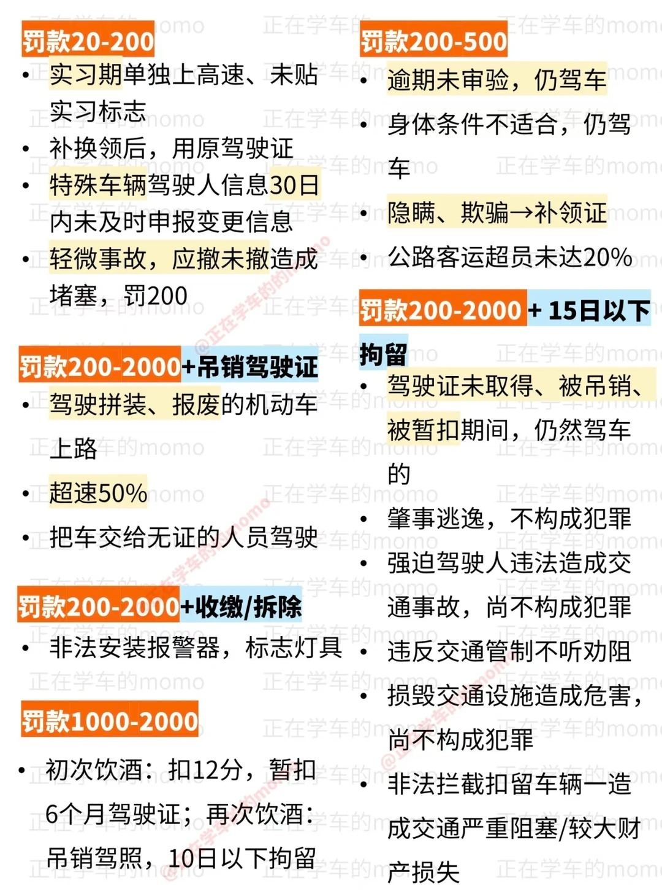

## 速记

```text
看到组织就选对
看到拘役就选对
看到“二百”或“200”就选对
看到“加速”选错，“不加速”选对
看到“直接”就选错
看到“避让”选对，“不避让”选错
看到“立即报警”、“迅速报警”就选对
看到“极易”
看到“追究”选对，“不追究”选错

故障停车：开双闪/设标志/人离开，迅速报警；标志普路50~100，高速150以上。
```

# 一【机动车登记】

### 变更登记

1、改变车身颜色

2、更换发动机/车身/车架/整车

3、营运改非营运/非营运改营运

4、住所迁出/迁入

### 不可登记

1、查封/扣押/抵押/处理事故期间

2、参数不符

临时号牌：临时上道路行驶，可用临时号牌

多个号牌：同辖区，同种类，非营运可互换

# 二【扣分关键词】

## 扣分口诀（除超速、超载、超员、疲劳驾驶）

### 1分：

1会禁止用灯光，1条安全带检验人的长宽高

```text
>   不按规定会车、普通公路倒车、掉头
>   违反禁令标志、禁令标线
>   不按规定使用灯光
>   未系安全带
>   未按照规定进行安全技术检验
>   长、宽、高超过规定
```

### 3分：

3心两意打电话，礼让三分不串道，不按规定装车牌，出了故障谁知道。

打电话，不礼让；
乱借道，占车行；
高速慢，普通逆；
牌不装，故障忘。

```text
> 拨打电话
> 不按规定避让人、避让校车
> 借道超车、占用、穿插
> 高速公路不按规定车道行驶（低速行驶）
> 普通公路逆行
> 不按规定安装机动车牌
> 出故障后未按照规定处理，无灯光和警告标志
```

### 6分：

6分基本都带“口”，占扣信号品损失

```text
> 爆炸物、易燃易暴化学品
> 不按信号灯通行
> 驾驶证扣留期间驾驶机动车
> 占用应急车道
> 轻微伤或财产损失，事后巡逸且不构成犯罪
```

### 9分：

9分无遮牌，车型不对；没证开校，高速乱停。

```text
> 未悬挂车牌或者故意遮挡
> 与准驾车型不符
> 未取得校车驾驶资格证
> 高速公路违法停车
```

### 12分：

12分精神得保持，高速逆行是乱造。饮酒替酒不开车， 轻伤死亡不可取。

```text
> 饮酒
> 伪造、变造车牌
> 高速公路倒车、逆行
> 代替行为处罚和谋求利益
> 致人轻伤以上或者死亡，事后逃逸且不构成犯罪
```

## 其他事项（超速、超载、超员、疲劳驾驶）

```text
超载：货车超载136
超员：7下3/6，7上6/9，100% 12，营运客车12%以上直接12分 [n]座[50%以下/50%以上]
超速：普136高速612校普169

疲劳驾驶（4小时休息低于20分钟）
载货3载人9
```

## 其他口诀

```text
代扣牟利，3倍5万12分
```

# 三【驾驶证】

```text
车找登记地车管所，证找任意
满90变30审30
```

## 报考处罚

**口诀：假一吊二骗三毒三撤三醉五逃终生**

```text
假一提供虚假材料，一年不得报考

吊二吊销驾驶证后，两年不得报考

撤三被撤销驾驶证后，三年不得报考

醉五醉驾被吊销驾驶证，五年不得报考，营运车辆10年不得报考

逃终生交通肇事逃逸，终生不能考驾照
```

## 申请

```text
三年内有吸食、注射毒品行为或者解除强制隔离戒毒措施未满三年，以及长期服用依赖性精神药品成瘾尚未戒除的，不得申领机动车驾驶证。
```

### 初次申领

```text
客挂不可初申领

20-50申请城市公交车，大型货车，无轨电车

21-50申请中型客车

24-50申请牵引车

26-50申请大型客车

```

## 处罚

```text
酒后驾车发生重大事故构成犯罪，会被吊销驾驶证，终身不得申请
```

## 补领

```text
驾驶证补领补发，原驾驶证应作废，使用原驾驶证的会被处20-200罚款，并收回原驾驶证。
```

# 四【车型】

```text
C6轻牵,C1/C2一年以上增驾,20~70周岁
B1中客，可开小车
```

# 五【扣车】

**口诀：未带两证两标一号牌**

释义：

两证：驾驶证、行驶证

两标：保险标志、检验合格标志

一号牌：机动车号牌

# 六【满分学习】

## 速记

```text
1. 记分周期12个月，满分12分
2. 自初次领取驾驶证之日起连续计算，或自初次取得临时驾驶许可之日起累积计算
3. 记分未达12分:罚款已缴纳→计分清除;罚款未缴纳→转入下一个记分周期
```

**注意：满分学习会暂扣驾驶证，学习通过也需要等待暂扣期满**

**口诀：学7累5少2上限60，学30累10少5上限120**

```text
释义：
现场学习、网络学习累计 -> 累计
现场学习不得少于 -> 少
现场学习、网络学习累计不得少于5天，现场学习不得少于2天。

学7天累5天少2天并通过考试，

大中型客货车、城市公交、重型牵引挂车学30累10少5剩余时间自主学习。

单日连续参加现场/网络学习3小时按一天记，重复学习不计。
```

**口诀：现场满1减2，公益满1减1**

## 减免

```text
记分满12分重考科一

记分满24分重考科一、科三(道路)

记分满36分重考科一、科二（场地）、科三(道路)

记分减免:在一个记分周期内累计最高扣减6分，在本周期或上一个记分周期有2次以上累积记分满12的，不可以再减分。

减分过程弄虚作假：公安机关交通管理部分撤销扣减记录并处1000元罚款
```

# 七【罚款】

## 小技巧
```text
科目一考试技巧

在罚款题当中，如果某些情形记不清罚款的多少，可以尝试以下技巧去答题：

1、答案中有2000元的选项则选2000元，没有2000元的则选500元的选项；

2、没有2000元以上或1000元罚款的选项，那么则选择罚款金额最大的选项。
```



## 1000-2000

```text
酒驾
```

## 2000以下

```text
1. 考试中有贿赂、舞弊行为
2. 以不正当手段取得驾驶证
3. 代替他人参加审验教育
4. 代替他人参加满分教育、扣减记分
```

## 2000-5000

```text
1. 伪造、变造或使用伪造、变造驾驶证
2. 使用其他车辆的牌证
```

## 5000

```text
1.饮酒后驾驶营运机动车
```

## 200-2000

```text
1. 未取得/吊销/暂扣驾驶证期间驾驶
2. 借车给未取得/吊销/暂扣驾驶证的人驾驶
3. 造成交通事故后逃逸，尚不构成犯罪的
4. 机动车行驶超过规定时速50%的
5. 驾驶拼装、报废车
6. 强迫驾驶人违规，造成事故尚不构成犯罪的
7. 强行通行，不听劝阻
8. 危害交通设施尚不构成犯罪的
9. 非法安装警报器、标志灯具的
10. 非法拦车、扣车造成严重损失
11. 未取得学习驾驶证明学车
12. 没有教练员或者随车指导人员学车
13. 由不符合规定的人员随车指导学车
```


# 八【安全驾驶】

## 速记

```text
右让左，左让直，右侧先
上坡先减档；下坡挂抵挡，禁止熄火/空挡。
进入铁路道口前：一停、二看、三通过，进入铁路道口后：匀速勿换挡
山区超车选宽阔上坡
```

## 【超车】

```text
不得超车：复杂路、有来车、前车左拐、执行任务紧急车辆
```

## 【灯光】

```text
跟车/会车都开近光，150米远光换近光
```

## 【停车】

```text
口5站3。
口5：交叉路口、铁道路口、弯道、宽度不足四米的窄路、隧道等路口50米以内不得停车。
站3：公交站、加油站、消防站等站点30米以内不得停车。
```

## 【交通信号/标志】

```text
交通信号有信号灯、标志、标线、交通警察的指挥

交通标线有指示/警告/禁止

标志：红高蓝低黄建议

红色禁止标志
蓝色指示标志
黄色警告标志

路面上：白色菱形标线预告人形横道
路面上：黄色数字最高限速，白色数字最低限速

港湾式停靠站：中间实线两侧虚线的凹形停靠点。
错车道：蓝色背景 |>
斑马纹是诱导相关的
```

## 【限速规定】

```text
城市道路：无中线城3公4，有中线城5公7

30/40，50/70

特殊路段/天气/操作，限速30。例如：拐弯

高速限速60-120；与限速标志不一致的按标志。
两道：100/60；高速车道、行车道、应急通道，最左侧最高120，最低100，中间车道最低60，最高100。
三道：110/90/60，右侧慢车道最高90，最低60；超车道、高速道、慢速道。最左侧超车道最高120，最低110，中间最高110，最低90，右侧慢车道最高90，最低60.

高速限速：60-120；两道：100/60；三道：110/90/60。
高速车距：大于100选100，小于100选50。
高速能见度：261，145，52离。
匝道：一般有限速，最高不过40。驶出匝道后提速至60以上。
```

# 九 交通肇事罪/危险驾驶罪

## 肇事
```text
未逃3以下，死逃3-7，逃逸致死7以上

判断交通肇事：三个未开头的都不选
```

## 危险驾驶
```text
竞驾/醉驾，处拘役罚金
构成犯罪的才叫危险驾驶罪，例如：闯红灯算违法行为不构成危险驾驶罪。
```

## 醉驾/酒驾

```text
醉驾：血液酒精含量80mg/100ml以上；
酒驾：血液酒精含量20mg/100ml以上。

1. 初次饮酒驾驶机动车暂扣6个月驾驶证，罚款1000-2000元。
2. 再次饮酒驾驶机动车吊销驾驶证，5年内（营运10年）不得考驾照，10日拘留，罚款1000-2000元。
3. 酒驾、醉驾导致发生事故构成犯罪，情节严重，会被吊销驾驶证，终生不得再取得驾驶证。
```

### 酒驾

```text
1. 初次饮酒驾驶机动车暂扣6个月驾驶证，罚款1000-2000元。
2. 再次饮酒驾驶机动车吊销驾驶证，10日以下拘留，罚款1000-2000元。
3. 饮酒驾驶营运机动车吊销驾驶证，15日拘留，罚款5000，5年不得考取驾驶证
```

### 醉驾

```text
1. 一般情形：约束至酒醒，吊销驾驶证，追究刑事责任，处拘役并处罚金，5年不得考取驾驶证。罚金上限20000元。
2. 营运机动车：约束至酒醒，吊销驾驶证，追究刑事责任，处拘役并处罚金，10年不得考取驾驶证。重新取得驾驶证后，不得驾驶营运机动车。
```

**酒驾醉驾导致重大交通事故**
```text
1. 构成犯罪：3,3-7,7以上。
2. 对于醉酒导致重大事故的，可能终生不得重新取得驾驶证。
```

# 车辆辅助驾驶功能

```text
偏离会w（歪），巡找CC
```
